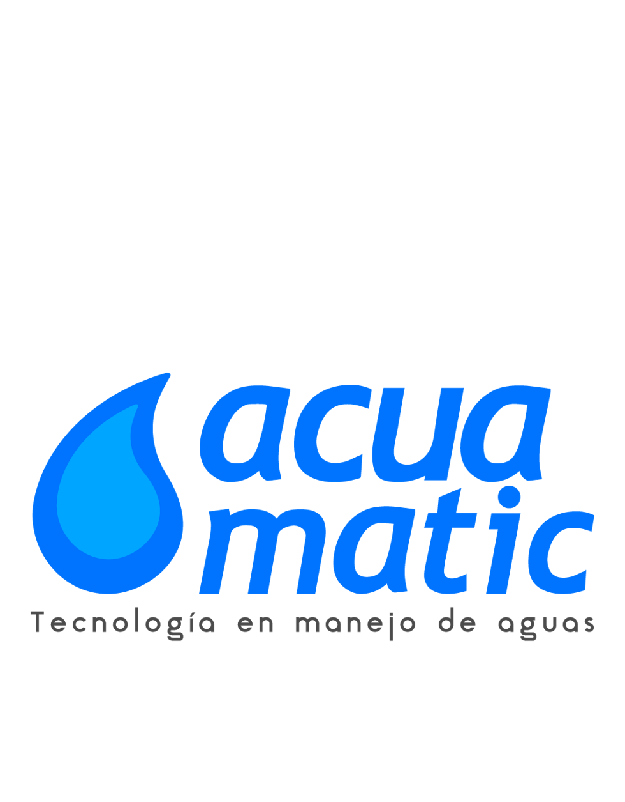

<!--Abrir Preview para ver resultado -->

<!-- Headings -->

# Title 1

## Title2

### Title 3

#### Title 4

##### Title 5

###### Title 6

Esto es un parrafo comun y corriente

this in an _italic_ text

<!--Esto es un salto de linea -->

this in an **strong** text

this in a ~~strikethrough~~ text

<!--UL-->

- Apple
  - Apple 2
- Orange
- etc

1. Apple
   1. Apple 2
2. Organe
3. etc

[Acuasmart.com](https://www.acuasmart.com)

<!--Para personalizar lo que se muestra cuando se hace hover-->

[Acuasmart.com](https://www.acuasmart.com "Custom Title")

<!--Esto es una sitacion -->

> This is a Quote

<!--Linea Horizontal -->

---

---

<!--Generar una linea de codigo-->

`console.log('hello world')`

<!--Generar un bloque de codigo, se puede especificar que tipo de lenguaje es-->

```javascript
import React from "react";
import "@testing-library/jest-dom/extend-expect";
import { render } from "@testing-library/react";
import CreateBoardTemplateContent from "./content";

test("renders content", () => {
  const component = render(<CreateBoardTemplateContent />);
  console.log(component);
});
```

```python
print("hello world")
```

```html
<h1>hello world</h1>
```

<!--
    Generar tablas
    Segun los puntos en la linea
    que divide los titulos del contenido, se puede tener centrado, en la derecha o izquierda
    -->

| Postre   | Calorias | Precio |
| -------- | :------: | -----: |
| Arequipe |  10kcal  |    10$ |
| Merengon |  20kcal  |    20$ |
| Yogurt   |  5kcal   |    30$ |

<!--Insertar imagen con url-->


<!--Insertar imagen local-->



<!--
    Github Markdown
    Opciones que solo se muestran en github
    Con la extension Markdown All in One
    se puede previsualizar
    -->

<!-- To do List -->

- [x] Task 1
- [ ] Task 2
- [ ] Task 3

<!-- Mencion a un usuario -->

@AndresPope

[Documentacion completa MarkDown](https://github.com/adam-p/markdown-here/wiki/Markdown-Here-Cheatsheet)
